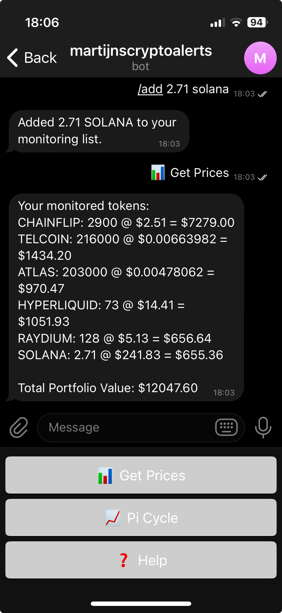

# Crypto Monitor Bot

A Telegram bot for monitoring cryptocurrency prices and technical indicators.

## Features

- 📊 Real-time cryptocurrency price monitoring
- 💼 Portfolio tracking with multiple cryptocurrencies
- ⏰ Customizable daily price updates
- 📈 Bitcoin Pi Cycle Top indicator
- 🔄 Auto-refreshing price cache
- ⚡ Rate limiting protection



## Setup

1. Clone the repository
2. Install dependencies:
```bash
npm install
```

3. Create a `.env` file in the root directory with:
```
TELEGRAM_BOT_TOKEN=your_bot_token_here
```

4. Build and start the bot:
```bash
npm start
```

## Available Commands

- `/start` - Initialize the bot and show main menu
- `/help` - Display all available commands
- `/add <amount> <ticker>` - Add cryptocurrency to portfolio
- `/remove <ticker>` - Remove cryptocurrency from portfolio
- `/list` - Show current portfolio and prices
- `/settime HH:mm` - Set daily update time (24h format)
- `/removetime` - Remove daily update timer
- `/picycle` - Show Bitcoin Pi Cycle Top indicator

## Technical Details

- Built with TypeScript and Node.js
- Uses CoinGecko API for price data
- Implements caching for API rate limit compliance
- Stores user data persistently in JSON format

## Development

To run in development mode with auto-reloading:
```bash
npm run dev
```

To watch for TypeScript changes:
```bash
npm run watch
```

## License

ISC License
